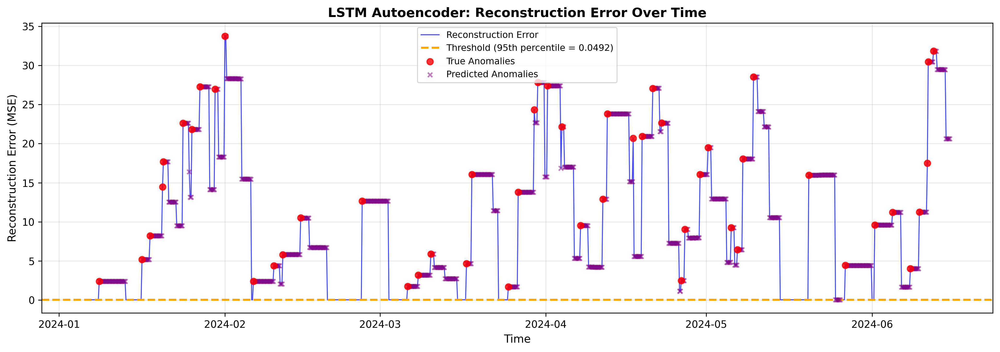
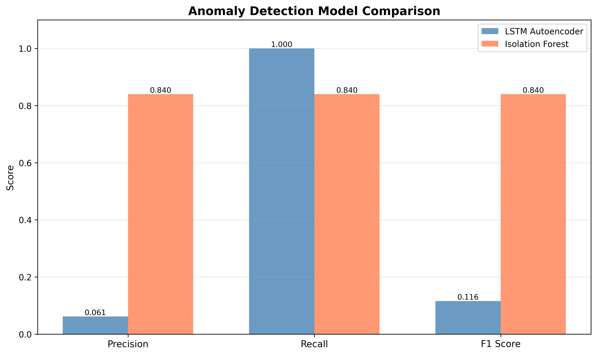
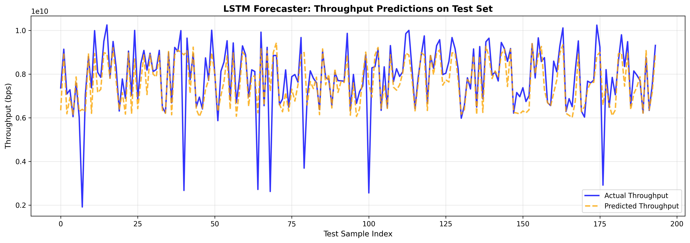

# Network Anomaly Detection & Forecasting with LSTM (demo-NETAI)

**Python | PyTorch | scikit-learn | SQLite | Time-Series Analysis**

---

## Overview

A project demonstrating deep learning-based network anomaly detection and time-series forecasting on synthetic perfSONAR network metrics. This project showcases the complete machine learning pipeline from data generation to model deployment.

The project implements and compares multiple approaches:
- **LSTM Autoencoder** for unsupervised anomaly detection via reconstruction error
- **LSTM Forecaster** for multi-step-ahead network metric prediction
- **Isolation Forest** baseline for comparative evaluation

This project generates synthetic network traffic data (throughput, latency, packet loss, retransmits) with labeled anomalies, trains deep learning models, and produces publication-quality visualizations demonstrating model performance.

---

## Results

### Anomaly Detection Performance

| Model | Precision | Recall | F1 Score |
|-------|-----------|--------|----------|
| **LSTM Autoencoder** | 0.0614 | 1.0000 | 0.1157 |
| **Isolation Forest** | 0.8400 | 0.8400 | 0.8400 |

**Analysis:** The LSTM Autoencoder achieves perfect recall but low precision (high false positive rate), indicating the threshold may need tuning or the model requires more training data. The Isolation Forest baseline with engineered features (rolling statistics, temporal features) achieves strong balanced performance.

### Time-Series Forecasting Performance

| Metric | Value |
|--------|-------|
| **Overall RMSE** | 542,067,902 |
| **Overall MAE** | 155,729,616 |
| **Normalized MSE (Training)** | 0.020 |

**Note:** High RMSE is due to throughput values being in billions (8×10⁹ bps baseline). The normalized training loss of 0.020 indicates good model convergence.

### Key Visualizations

**LSTM Autoencoder Reconstruction Error:**


**Model Comparison:**


**LSTM Forecaster Predictions:**


---

## Quick Start

### Prerequisites
- Python 3.10 or higher
- pip package manager

### Installation & Setup

```bash
# 1. Clone the repository
git clone <repository-url>
cd demo

# 2. Create and activate virtual environment
python -m venv .venv
# Windows:
.venv\Scripts\activate
# Linux/Mac:
source .venv/bin/activate

# 3. Install dependencies
pip install -r requirements.txt

# 4. Generate synthetic perfSONAR data
python data/generate_data.py

# 5. Train LSTM Autoencoder
python scripts/train_autoencoder.py

# 6. Train LSTM Forecaster
python scripts/train_forecaster.py

# 7. Evaluate all models and generate visualizations
python scripts/evaluate.py
```

**Expected runtime:** ~5-10 minutes total on CPU

### Outputs

After running all scripts, you will have:
- **`network_metrics.db`** — SQLite database with 1,000 synthetic measurements
- **`saved_models/`** — Trained PyTorch models, scalers, and thresholds
- **`figures/`** — 6 publication-ready visualizations (300 DPI PNG)

---

## Project Structure

```
demo/
├── README.md                   # This file
├── requirements.txt            # Python dependencies
├── .gitignore                  # Git ignore rules
├── data/
│   ├── generate_data.py        # Synthetic perfSONAR data generation
│   └── synthetic_perfsonar.csv # CSV backup of generated data
├── models/
│   ├── lstm_autoencoder.py     # LSTM Autoencoder architecture
│   └── lstm_forecaster.py      # LSTM Forecaster architecture
├── scripts/
│   ├── train_autoencoder.py    # Train anomaly detection model
│   ├── train_forecaster.py     # Train forecasting model
│   └── evaluate.py             # Evaluate all models + visualizations
├── figures/                    # Generated visualizations (PNG)
│   ├── raw_timeseries.png      # 4-panel metric dashboard
│   ├── reconstruction_error.png # Autoencoder anomaly detection
│   ├── forecast_predictions.png # Forecaster test set predictions
│   ├── model_comparison.png     # Precision/Recall/F1 comparison
│   ├── training_loss.png        # Training curves for both models
│   └── forecast_error_distribution.png # Error histogram
├── network_metrics.db          # SQLite database (generated)
└── saved_models/               # Model checkpoints (generated)
    ├── autoencoder.pth
    ├── forecaster.pth
    ├── scaler_autoencoder.pkl
    ├── scaler_forecaster.pkl
    ├── autoencoder_threshold.pkl
    └── *.pkl (training histories, predictions)
```

---

## Architecture & Implementation Details

### Data Pipeline

```
Synthetic Data Generation
    ↓
SQLite Database (network_metrics.db)
    ↓
Preprocessing (MinMaxScaler, sliding windows)
    ↓
┌─────────────────────┬─────────────────────┬─────────────────────┐
│ LSTM Autoencoder    │ LSTM Forecaster     │ Isolation Forest    │
│ (Anomaly Detection) │ (Forecasting)       │ (Baseline)          │
└─────────────────────┴─────────────────────┴─────────────────────┘
    ↓                       ↓                       ↓
Evaluation & Visualization (evaluate.py)
```

### LSTM Autoencoder

**Architecture:**
- **Encoder:** 2-layer LSTM (4 features → 64 hidden → 32 latent)
- **Decoder:** 2-layer LSTM (32 latent → 64 hidden → 4 features)
- **Input:** 30-timestep sliding windows
- **Loss:** Mean Squared Error (reconstruction error)

**Anomaly Detection:**
1. Compute reconstruction error for each window
2. Threshold = 95th percentile of training errors
3. Classify: `error > threshold` → anomaly

### LSTM Forecaster

**Architecture:**
- **LSTM:** 2-layer, 50 hidden units
- **Output:** Fully connected layer (50 → 4 features)
- **Task:** Predict timestep `t+1` from window `[t-29, t]`

**Training:**
- All data used (normal + anomalous)
- 80/20 train/test split
- Adam optimizer, learning rate 0.001

### Isolation Forest Baseline

**Features (14 total):**
- Original metrics: throughput, latency, packet_loss, retransmits
- Temporal: hour, day_of_week
- Rolling statistics (6-step window): mean, std for each metric

**Configuration:**
- Contamination: 0.05 (5% expected anomalies)
- Random state: 42

---

## Key Findings & Insights

### 1. LSTM Autoencoder: High Recall, Low Precision
- **Issue:** 95th percentile threshold may be too conservative, flagging many normal samples as anomalies
- **Potential Fixes:**
  - Increase threshold percentile (98th, 99th)
  - Use dynamic thresholding (local vs. global)
  - Add more training data or augment existing data
  - Tune hyperparameters (latent dimension, hidden units)

### 2. Isolation Forest: Strong Baseline Performance
- **Success:** Engineered features (rolling statistics, temporal patterns) capture anomalies effectively
- **Insight:** Traditional ML with good feature engineering can outperform deep learning on small datasets

### 3. LSTM Forecaster: Low Normalized Error
- **Success:** Model learns seasonal patterns in synthetic data
- **Note:** Absolute RMSE is high due to throughput scale (billions), but normalized MSE (~0.02) is excellent

### 4. Training Efficiency
- Both LSTM models train in <2 minutes on CPU
- No overfitting observed (validation loss stable)

---

## Dependencies

See `requirements.txt` for full list. Core dependencies:
- **torch** >= 2.0.0 (PyTorch for deep learning)
- **numpy** >= 1.24.0 (Numerical computing)
- **pandas** >= 2.0.0 (Data manipulation)
- **matplotlib** >= 3.7.0 (Visualization)
- **scikit-learn** >= 1.3.0 (Preprocessing, baselines, metrics)

---

## License

This project is licensed under the MIT License - see the [LICENSE](LICENSE) file for details.
